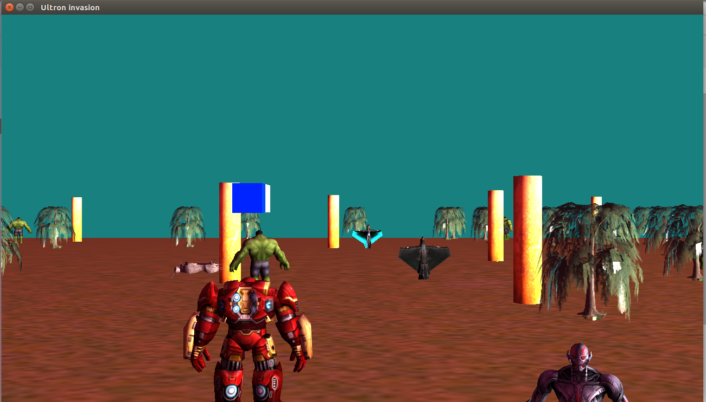
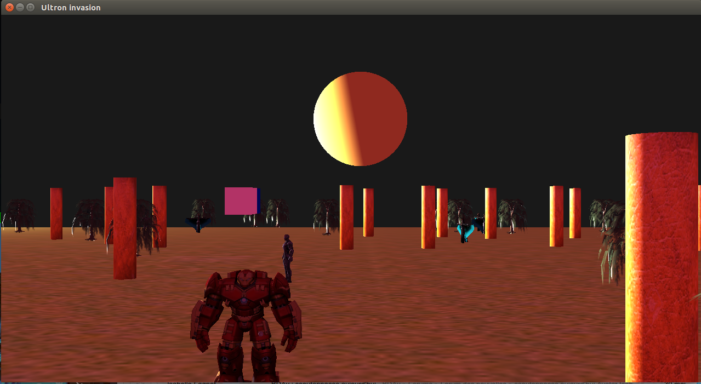

# IronShootFX
shoot em all java FX API 3D 

le jeu est fais en 3D avec l'API jeune de JavaFX.

pour lancer le programme lancer le compile.sh.
les fleches sont pour bouger 
les touches : 
q :tourner la camera de 90 degres
d :tourner de l'autre coté
s : tourner pistolero
f :tourner de l'autre cote pistolero
w :avancer la camera (pour mieux viser
a :Voler (augmente la vitesse de pistolero)

<ESPACE> : pour mettre en plein ecran.

z ou (clic avec la souris):tirer une boule rotationel (attendre le chargement)

p : affiche une fenetre avec des informations (nombre de vampires un slider pour la vitesse)

Note : si pistolero disparait appuyer sur a.

